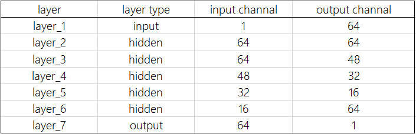

# AV1_s_model
small model's training, testing code and example
## Source Code Introduction
**nf_MODEL.py** : define the structure of network  
**nf_UTILS.py** : define some tools  
**nf_TEST.py** : choose one model, test all of the epoch and get the best one  
**sep_TEST.py** : test by seperated gradient, you can also directly choose one model to test the efficiency with out iterating each epoch  
**nf_UNK.py** : training code, you can modify the path and parameters on the top of content to train your own model  
## Directory Introduction  
**checkpoints** : contains best model of every gradient  
**gt** : ground truth(or label)  
**av1_recon_qp53** : reconstruction image after AV1 encoding with QP53 (quantization Parameter = 53)  
**doc** : some documents help to use the code(English version not complete yet)  
## Network Structure Intruduction
  Network of the Small Model is comprised of 7 cascading convolutional layers, including an input layer, an output layer and 5 hidden layers.  
  Each convolutional layers are 3×3 size. Using ReLU activating function. Stride is [1, 1, 1, 1].(Means sliding step is 1.)  

   

